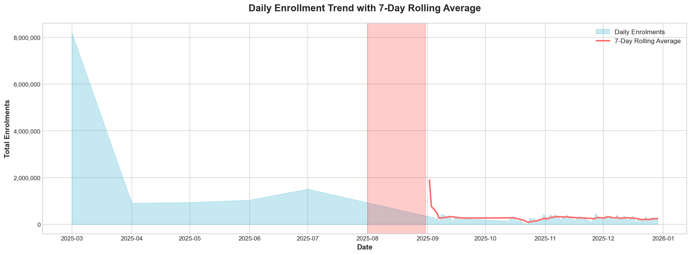
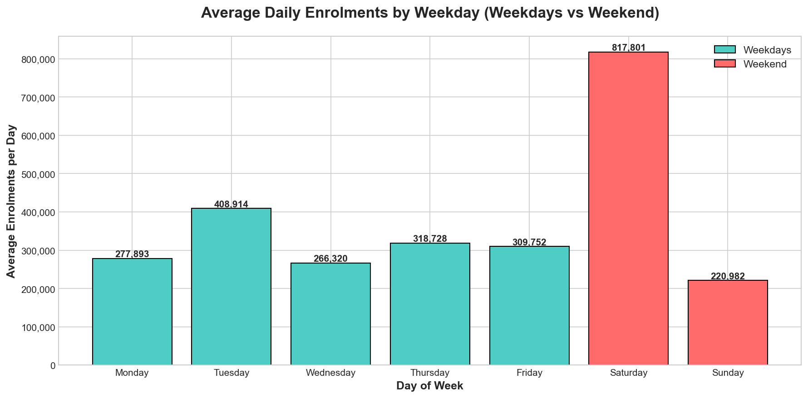
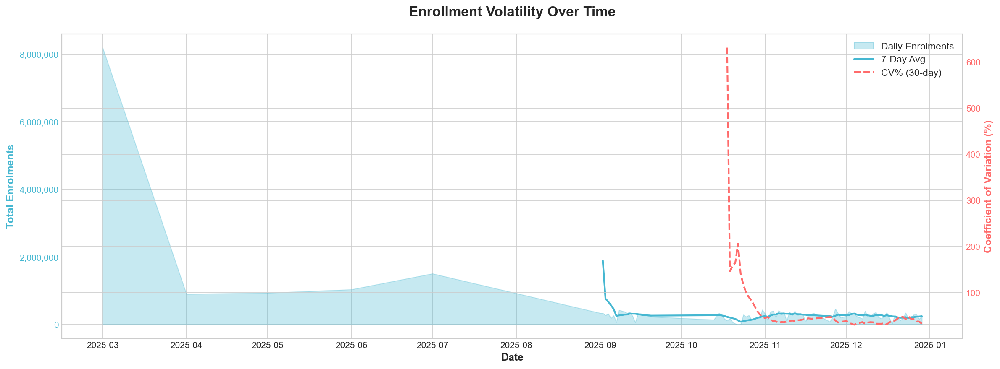

# Aadhaar Demographics Analysis Report

**Analysis Date:** June 2026  
**Dataset Period:** March 2025 - December 2025  
**Total Records Analyzed:** 1,559,040 (after removing 21.6% duplicates)  
**Total Enrolments:** 36,076,386

---

## Executive Summary

This analysis reveals critical data quality issues and meaningful patterns in Aadhaar enrollment data. Key findings include severe data inconsistencies (9 variations of "West Bengal"), a missing month of data (August 2025), and counter-intuitive enrollment patterns where weekends show 70% HIGHER enrolments than weekdays. Uttar Pradesh dominates with 17.7% of all enrolments, while child enrollment remains concerningly low at 9.8%.

---

## ⚠️ Critical Data Quality Issues

### 1. State Name Inconsistencies
The dataset contains **9 different variations** of "West Bengal":
- `West Bengal` (correct) — 120,358 records
- `West Bangal` — 95 records
- `West  Bengal` — 58 records
- `Westbengal` — 58 records
- `WEST BENGAL` — 44 records
- `WESTBENGAL` — 33 records
- `West bengal` — 29 records
- `west Bengal` — 8 records
- `West Bengli` — 2 records

**Impact:** Geographic analysis is compromised. Aggregations must clean these variations.

### 2. Missing August 2025 Data
The entire month of August 2025 is **completely absent** from the dataset. This creates:
- A gap in temporal trend analysis
- Distorted monthly comparisons
- Potential missing context for September spikes

### 3. Duplicate Records
**430,010 duplicate records (21.6%)** were removed during cleaning. This high duplication rate suggests:
- Possible data entry system issues
- Multiple submissions of same enrollment records

### 4. Other Data Entry Issues
- `andhra pradesh` (lowercase) — 36 records
- `ODISHA` / `odisha` — 38 records combined
- Invalid state entries: `100000`, `Darbhanga`, `Puttenahalli`

---

## 📊 Key Enrollment Patterns

### Monthly Distribution

| Month | Enrolments | Share | Child % |
|-------|-----------|-------|---------|
| March 2025 | 8,190,152 | 22.7% | 8.8% |
| November 2025 | 7,084,305 | 19.6% | 8.7% |
| December 2025 | 7,117,802 | 19.7% | 9.8% |
| September 2025 | 5,909,625 | 16.4% | 10.6% |
| October 2025 | 3,375,616 | 9.4% | 9.6% |
| July 2025 | 1,510,892 | 4.2% | 12.9% |
| June 2025 | 1,040,944 | 2.9% | 11.8% |
| May 2025 | 939,768 | 2.6% | 13.1% |
| April 2025 | 907,282 | 2.5% | 13.2% |

**Insight:** March 2025 alone accounts for 22.7% of all enrolments, suggesting either a data capture anomaly or a major enrollment drive. The pattern is highly unusual.

### Weekday Pattern (Counter-Intuitive Finding)

| Day | Total Enrolments | Avg/Day |
|-----|-----------------|---------|
| Saturday | 11,449,222 | **817,802** |
| Tuesday | 6,133,722 | 408,915 |
| Thursday | 4,462,199 | 318,728 |
| Friday | 4,026,783 | 309,753 |
| Monday | 3,890,507 | 277,893 |
| Wednesday | 3,462,161 | 266,320 |
| Sunday | 2,651,792 | 220,983 |

**⚠️ CRITICAL INSIGHT:** Saturdays show **2.5x higher** enrolments than average weekdays! This contradicts the expected pattern of lower weekend activity. Possible explanations:
1. Special Saturday enrollment camps
2. Data recording delays batched to Saturdays
3. System upload patterns favoring weekends

### Daily Volatility
- **Coefficient of Variation:** 220% (extremely high)
- **Peak Day:** March 1, 2025 — 8,190,152 enrolments
- **Lowest Day:** October 22, 2025 — 7,039 enrolments
- **Ratio (Peak:Low):** 1,163:1

This extreme volatility indicates inconsistent data capture or genuine operational variations.

---

## 🏆 Geographic Insights

### Top 10 States by Enrollment

| Rank | State | Enrolments | Share | Child % |
|------|-------|-----------|-------|---------|
| 1 | Uttar Pradesh | 6,377,217 | 17.68% | 9.3% |
| 2 | Maharashtra | 3,753,409 | 10.40% | 5.4% |
| 3 | Bihar | 3,582,238 | 9.93% | 7.9% |
| 4 | West Bengal | 2,766,774 | 7.67% | 6.2% |
| 5 | Madhya Pradesh | 2,087,431 | 5.79% | 13.8% |
| 6 | Rajasthan | 2,046,301 | 5.67% | 9.2% |
| 7 | Tamil Nadu | 1,666,329 | 4.62% | 14.3% |
| 8 | Andhra Pradesh | 1,621,280 | 4.49% | 13.9% |
| 9 | Chhattisgarh | 1,402,668 | 3.89% | 8.3% |
| 10 | Gujarat | 1,342,104 | 3.72% | 11.4% |

**Insight:** Top 3 states (UP, Maharashtra, Bihar) account for **38%** of all enrolments.

### Top 10 Districts

| Rank | District | State | Enrolments | Child % |
|------|----------|-------|-----------|---------|
| 1 | Thane | Maharashtra | 322,577 | 8.0% |
| 2 | Pune | Maharashtra | 321,347 | 7.4% |
| 3 | South 24 Parganas | West Bengal | 294,336 | 6.9% |
| 4 | Murshidabad | West Bengal | 256,619 | 8.3% |
| 5 | Surat | Gujarat | 254,764 | 9.8% |
| 6 | Bengaluru | Karnataka | 219,795 | 12.5% |
| 7 | North West Delhi | Delhi | 216,692 | 12.9% |
| 8 | North 24 Parganas | West Bengal | 204,419 | 5.1% |
| 9 | Ahmedabad | Gujarat | 196,585 | 11.9% |
| 10 | Solapur | Maharashtra | 196,132 | 3.0% |

---

## 👶 Child Enrollment Analysis

### Overall Child Enrollment
- **Total Children (5-17 years):** 3,548,646
- **Percentage of Total:** 9.8%
- **Adult (18+):** 32,527,740 (90.2%)

### States with Highest Child Enrollment %

| State | Child % | Total Enrolments |
|-------|---------|-----------------|
| Ladakh | 23.5% | 4,444 |
| Dadra and Nagar Haveli | 21.3% | 4,365 |
| Puducherry | 16.3% | 18,650 |
| Arunachal Pradesh | 16.0% | 27,717 |
| Karnataka | 15.6% | 1,242,089 |

### States with Lowest Child Enrollment % (Focus Areas)

| State | Child % | Total Enrolments |
|-------|---------|-----------------|
| Maharashtra | 5.4% | 3,753,409 |
| West Bengal | 6.2% | 2,766,774 |
| Punjab | 6.4% | 634,285 |
| Orissa | 6.5% | 22,106 |
| Jharkhand | 7.2% | 1,052,863 |

**⚠️ INSIGHT:** Maharashtra, despite being 2nd in total enrolments, has the **lowest child enrollment rate (5.4%)**. This could indicate:
- Saturation in child enrollment
- Data quality issues
- Demographic shift
- Need for targeted child enrollment drives

---

## 🔍 Anomalies Detected

Two statistically significant anomalies (Z-score > 2):

1. **September 14, 2025 (Sunday)** — DROP
   - Enrolments: 72,183
   - Z-score: -2.02
   - Possible cause: System maintenance or holiday

2. **October 31, 2025 (Friday)** — SPIKE
   - Enrolments: 440,751
   - Z-score: +2.06
   - Possible cause: Month-end enrollment push or data backfill

---

## 📈 Visualizations

### 1. Daily Enrollment Trend

Shows the extreme volatility and the August data gap.

### 2. Monthly Distribution

March 2025 dominates the enrollment landscape.

### 3. Top States

Uttar Pradesh leads significantly.

### 4. Age Distribution

Adult enrollment dominates across all months.

### 5. Child Enrollment by State

Significant variation across states.

### 6. Weekday Pattern

Saturday anomaly is clearly visible.

### 7. Top Districts

Urban districts dominate.

### 8. Volatility Analysis

Shows enrollment instability over time.

---

## 🎯 Key Recommendations

### Data Quality Improvements
1. **Standardize state names** — Implement a master lookup table
2. **Add validation rules** — Prevent lowercase, misspellings, invalid entries
3. **Investigate August 2025 gap** — Determine if data exists but wasn't captured
4. **Deduplication process** — Investigate source of 21.6% duplicates

### Operational Insights
1. **Saturday enrollment camps** — Leverage the high Saturday activity
2. **Child enrollment focus** — Target Maharashtra, West Bengal, Punjab for child enrollment drives
3. **Volatility investigation** — Understand why daily enrolments vary by 1,163x

### Further Analysis
1. **Time series forecasting** — Requires August data for completeness
2. **District-level deep dive** — Understand why Solapur has only 3% child enrollment
3. **Seasonal patterns** — Analyze year-over-year trends when more data available

---

## 📋 Data Summary

| Metric | Value |
|--------|-------|
| Total Records (raw) | 1,989,050 |
| Total Records (cleaned) | 1,559,040 |
| Duplicates Removed | 430,010 (21.6%) |
| Date Range | Mar 1 - Dec 29, 2025 |
| Missing Days | 209 (including August) |
| Total Enrolments | 36,076,386 |
| Children (5-17) | 3,548,646 (9.8%) |
| Adults (18+) | 32,527,740 (90.2%) |
| Unique States | 65 (after cleaning: ~40) |
| Unique Districts | 762 |
| Unique Pincodes | 14,007 |

---

**Report Generated:** June 2026  
**Analysis Tool:** Python (Pandas, Matplotlib, Seaborn)  
**Data Source:** Aadhaar Demographics Dataset 2025
