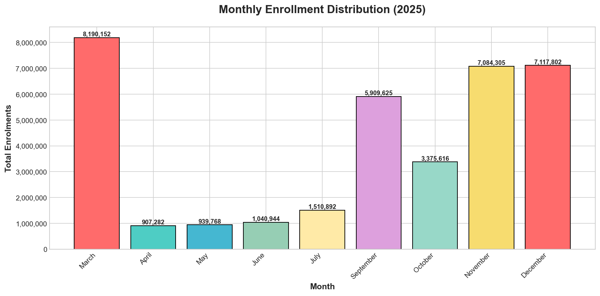
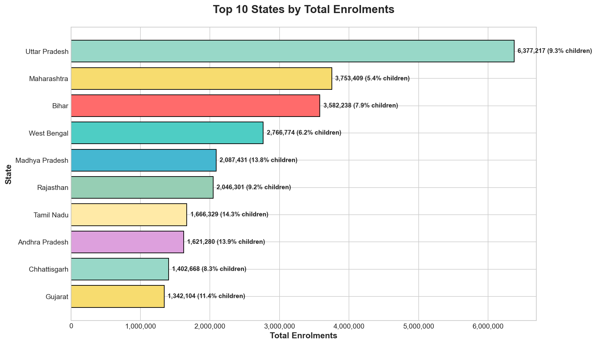
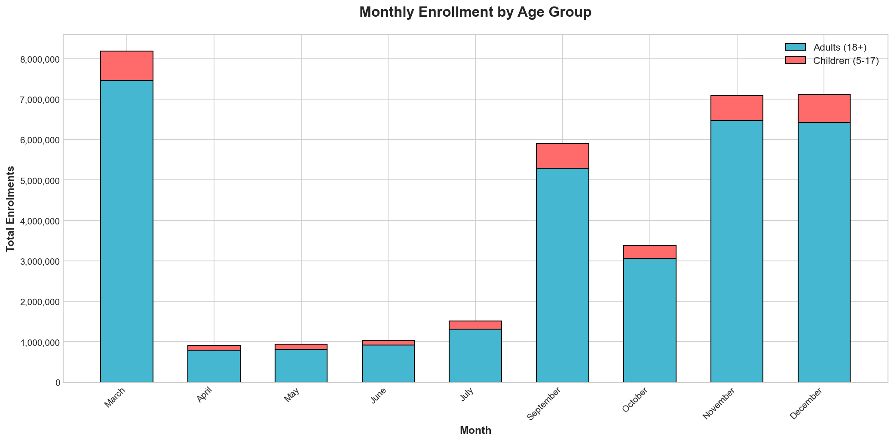
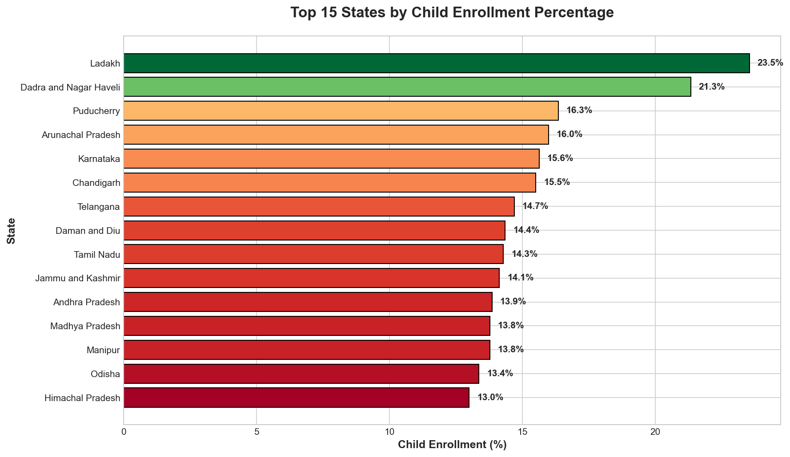
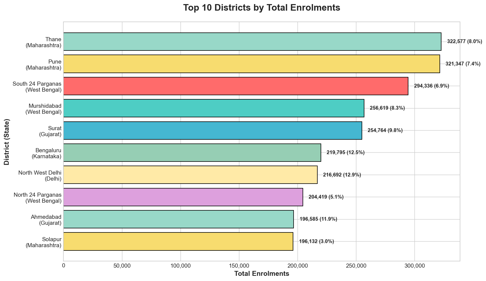

# Aadhaar Demographics Analysis

[](https://python.org)
[](https://streamlit.io)
[](https://react.dev)
[](https://typescriptlang.org)
[](LICENSE)

End-to-end analytics pipeline on **Aadhaar (UIDAI) enrollment data** across Indian states, districts & pincodes. Includes Python ETL & statistical modeling, an interactive Streamlit dashboard, and a production-grade React/TypeScript dashboard with time-series forecasting and K-Means clustering.

---

## Repository Map

| Path | Description |
|------|-------------|
| [`docs/report.md`](docs/report.md) | Full analysis report with tables, anomalies & recommendations |
| [`data/README.md`](data/README.md) | Data source & schema documentation |
| [`output/exports/`](output/exports/) | Cleaned CSV exports (state, district, daily summaries + key insights) |
| [`output/plots/`](output/plots/) | 8 publication-ready visualizations |
| [`src/analysis.py`](src/analysis.py) | ETL pipeline — cleaning, feature engineering, statistical analysis |
| [`src/plots.py`](src/plots.py) | Matplotlib/Seaborn plot generation |
| [`app.py`](app.py) | Streamlit interactive dashboard |
| [`dashboard/`](dashboard/) | React 19 + TypeScript + Vite enterprise dashboard |
| [`notebooks/01_exploration.ipynb`](notebooks/01_exploration.ipynb) | Jupyter notebook with full exploration |

---

## Features

### Data Pipeline
- **Cleaning** — deduplication (430K dupes removed), state name standardization (9 variants of "West Bengal"), type coercion
- **Feature engineering** — rolling averages, Z-score anomalies, WoW/MoM growth, day-of-week, per-capita enrollment, child-to-adult ratios
- **Statistical analysis** — anomaly detection (|Z| > 2), volatility (CV = 220%), K-Means clustering by enrollment volume & child %

### Interactive Dashboards

| Dashboard | Technology | Capabilities |
|-----------|-----------|--------------|
| **Streamlit** [`app.py`](app.py) | Python + Plotly | Trends, state/district drill-down, seasonality heatmaps, K-Means clusters, anomaly highlighting |
| **React** [`dashboard/`](dashboard/) | React 19 + Recharts + TypeScript | 6 tabs (Trends, States, Seasonality, Districts, Clusters, Forecast), CSV export, per-capita analysis, time-series forecasting |

Run **Streamlit**: `streamlit run app.py`
Run **React**: `cd dashboard && npm install && npm run dev`

### Exports
- [`state_summary.csv`](output/exports/state_summary.csv) — 40 states with enrollment, child %, per-capita, share %
- [`district_summary.csv`](output/exports/district_summary.csv) — 923 districts ranked within state
- [`daily_enrollment.csv`](output/exports/daily_enrollment.csv) — 96 days of national totals
- [`key_insights.csv`](output/exports/key_insights.csv) — 8 distilled findings

---

## Insights

### 1. Data Quality
- **9 spelling variants** of "West Bengal" found (e.g., "West Bangal", "WESTBENGAL", "West Bengli")
- **21.6% duplicate records** — 430K of 1.99M rows removed
- **August 2025 entirely missing** — creates a temporal gap
- Invalid entries: `"100000"`, `"Darbhanga"`, `"Puttenahalli"` as state names

### 2. Critical Enrollment Patterns
- **March 2025 anomaly** — 22.7% of all enrollments (8.19M) in a single month
- **Saturday paradox** — 2.5× higher enrollment than average weekday (817K vs ~320K)
- **Extreme volatility** — peak day (8.19M) vs lowest day (7K) = **1,163:1 ratio**
- **Child enrollment** — only **9.8%** of total (3.5M of 36M)

### 3. Geographic Dominance
| Rank | State | Enrollments | Share |
|------|-------|-------------|-------|
| 1 | Uttar Pradesh | 6.38M | 17.7% |
| 2 | Maharashtra | 3.75M | 10.4% |
| 3 | Bihar | 3.58M | 9.9% |
| | **Top 3** | **13.7M** | **38%** |

- **Thane & Pune** (Maharashtra) are the top districts
- **Maharashtra** has the lowest child enrollment rate (5.4%) despite ranking #2 in volume
- **Ladakh** has the highest child enrollment % (23.5%) but only 4,444 total enrollments

### 4. Anomalies Detected
| Date | Day | Event | Enrollments | Z-score |
|------|-----|-------|-------------|---------|
| Sep 14, 2025 | Sunday | **DROP** | 72,183 | -2.02 |
| Oct 31, 2025 | Friday | **SPIKE** | 440,751 | +2.06 |

---

## Visualizations

### Daily Enrollment Trend

*Daily enrollment with 7-day rolling average. The August gap and extreme March spike are clearly visible.*

### Monthly Distribution

*March, November & December dominate. April–July show minimal activity.*

### Top States

*Uttar Pradesh leads with 17.7% share; Maharashtra and Bihar follow.*

### Age Distribution

*Adult enrollment (18+) dominates across all months. Child enrollment is consistently low.*

### Child Enrollment by State

*Wide variation — Ladakh (23.5%) to Maharashtra (5.4%).*

### Weekday Pattern

*Saturday shows 2.5× higher enrollment than average weekdays.*

### Top Districts

*Thane and Pune lead; 7 of top 10 are from Maharashtra, West Bengal, or Gujarat.*

### Volatility Analysis

*Coefficient of Variation = 220%. Enrollment instability persists across the entire period.*

---

## Setup

```bash
# Python environment
pip install -r requirements.txt

# Run full analysis
python src/analysis.py

# Generate plots
python src/plots.py

# Launch Streamlit dashboard
streamlit run app.py

# React dashboard (separate terminal)
cd dashboard && npm install && npm run dev
```

---

## Data Summary

| Metric | Value |
|--------|-------|
| Raw records | 1,989,050 |
| Cleaned records | 1,559,040 |
| Duplicates removed | 430,010 (21.6%) |
| Date range | Mar 1 – Dec 29, 2025 |
| Total enrollments | 36,076,386 |
| Children (5–17) | 3,548,646 (9.8%) |
| Adults (18+) | 32,527,740 (90.2%) |
| States/UTs | ~40 |
| Districts | 762 |
| Pincodes | 14,007 |

---

**Report:** [`docs/report.md`](docs/report.md) | **Data source:** UIDAI Aadhaar Data Hackathon 2026
